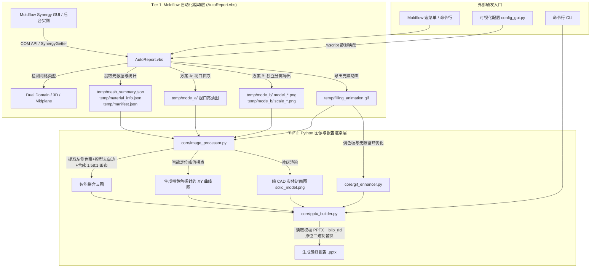

# HYT-MLFXBG AI 开发者接手与技术避坑全景指南 (AI Agent Handover Guide)

> **致未来的 AI 协作者**：  
> 本项目历经多轮实机打磨，攻克了从 Autodesk Moldflow 底层 COM 接口调用、VBScript 跨进程通信、高保真图像拼合到 `python-pptx` 底层 XML 图元操纵的数十个深度隐性技术陷阱。  
> **在修改代码前，请务必完整通读本指南，尤其是第三部分的“10 大核心踩坑经验”！遵循既定模式，切忌盲目推倒重来。**

---

## 🏗️ 一、 系统架构与跨语言协同机制

本项目采用 **双层混合自动化架构 (Two-Tier Hybrid Automation)**：



### 数据契约 (`temp/` 目录规范)
- `manifest.json`：存储方案名、零件名、分析版本、日期等；
- `mesh_summary.json`：包含网格单元数、表面积、体积、纵横比、匹配率百分比（`match_ratio`）；
- `material_info.json`：包含贸易名称、厂家、推荐模温/熔温、最大剪切速率等 14 项材料属性；
- `clamp_force_info.json`：包含 CAE 计算出的最大锁模力吨位 (`cae_max_clamp_force`)；
- `solid_model.png`：专供封面使用的无网格、无节点纯 CAD 冷灰金属质感实体图。

---

## 📁 二、 核心代码拓扑与模块职责

| 文件路径 | 语言/格式 | 核心职责与设计原则 |
| :--- | :--- | :--- |
| [`AutoReport.vbs`](file:///c:/Users/5600/Documents/ZDH/MLFXBG/AutoReport.vbs) | VBScript (GBK) | Moldflow 宏主入口。负责调度 Synergy COM API，导出网格数据、材料参数、视口截图、方案 B 分离切片，最后静默唤醒 Python 处理。 |
| [`config_gui.py`](file:///c:/Users/5600/Documents/ZDH/MLFXBG/config_gui.py) | Python (Tkinter) | 用户图形配置中心。管理 `report_config.json`，提供方案 A/B 单选、30+ 种结果勾选、动图帧数调节，以 `wscript` 零黑框唤醒自动化。 |
| [`report_config.json`](file:///c:/Users/5600/Documents/ZDH/MLFXBG/report_config.json) | JSON (UTF-8) | 系统主配置文件。声明母版路径、输出目录、截图模式（默认 `"B"`）、各分析结果项别名及其对应幻灯片页码。 |
| [`core/pptx_builder.py`](file:///c:/Users/5600/Documents/ZDH/MLFXBG/core/pptx_builder.py) | Python (python-pptx) | PPTX 生成核心引擎。加载母版，通过 `blip_rId` 原位替换图片，严格继承文本框与表格格式，负责自适应满幅排版与页面图元清空。 |
| [`core/image_processor.py`](file:///c:/Users/5600/Documents/ZDH/MLFXBG/core/image_processor.py) | Python (Pillow/NumPy) | 方案 B 专属图像处理流水线。实现色带提取、模型紧致白边裁剪、三维坐标系透明化、XY 曲线拐点定位与黄色探针绘制、纯 CAD 实体生成。 |
| [`core/gif_enhancer.py`](file:///c:/Users/5600/Documents/ZDH/MLFXBG/core/gif_enhancer.py) | Python (Pillow) | 充填时间动图优化器。通过自适应调色板、帧间差分压缩与强制无限循环标记，保证 GIF 体积轻量且播放极其丝滑。 |
| [`PROJECT_SESSIONS.md`](file:///c:/Users/5600/Documents/ZDH/MLFXBG/PROJECT_SESSIONS.md) | Markdown | 跨会话追踪与项目记忆索引。记录历史会话 ID、断点状态与真实存储路径，支持 AI 瞬间重载上下文。 |
| [`使用说明.md`](file:///c:/Users/5600/Documents/ZDH/MLFXBG/使用说明.md) | Markdown | 最终用户操作手册与功能详解。 |

---

## ⚠️ 三、 10 大技术陷阱与底层避坑指南 (The Hall of Gotchas)

### 坑 1：VBScript 脚本宿主环境差异与 GBK 乱码危机
* **陷阱表现**：
  1. 在 Moldflow 内部运行宏时，执行 `WScript.Echo` 或 `WScript.Sleep` 会直接报 `Object required: 'WScript'` 崩溃；
  2. 如果将 `AutoReport.vbs` 以 UTF-8 格式保存，VBScript 解释器（默认按系统 ANSI 即 CP936/GBK 读取）会将中文字符串解析成乱码，导致 `InStr(name, "所有效应")` 永远为 0，甚至报语法错。
* **避坑法则**：
  - **绝不直接依赖 `WScript` 对象**：读取脚本路径等属性时，必须包裹 `On Error Resume Next`；如需延时，使用 WshShell 或 Synergy 自带等待；
  - **`AutoReport.vbs` 必须且只能保存为 GBK/ANSI 编码**！编辑该文件时，Python 脚本必须指定 `encoding='gbk'`，严禁使用纯 UTF-8 覆盖；
  - **控制台弹窗抑制**：调用 VBS 时使用 `wscript.exe` 而非 `cscript.exe`；Python 中使用 `subprocess.Popen(["wscript", ...])`，杜绝黑色终端窗口闪烁。

---

### 坑 2：Moldflow COM API `SaveImage3` 色带丢失与视角复位
* **陷阱表现**：
  - 调用 `Viewer.SaveImage3` 导出模型云图时，Moldflow 会丢弃左侧彩条标尺（Legend），只导出孤立的模型；若强制开启标尺，Synergy 又会自动调用 `Viewer.Fit` 强制居中，将模型与标尺挤压重叠在一起，且画质严重模糊。
* **避坑法则**：
  - **采用方案 B 双图独立导出**：
    1. 第一步：隐藏标尺 `Plot.ShowColorScale(False)`，仅导出超大纯净模型 `model_<key>.png`；
    2. 第二步：独立提取标尺图像 `Plot.SaveColorScaleImage(...)` 或从视口裁剪色带 `scale_<key>.png`；
    3. 第三步：在 Python 中通过 Pillow 将二者按 `1.58:1` 黄金比例重构拼合，彻底绕过官方 API 缺陷。
  - **翘曲/变形结果的 ID 探测**：不同版本与语言中，“变形”可能叫“翘曲”、“总变形”或“Deflection”。**切勿单纯依赖字符串匹配**，必须优先使用 `PlotManager.FindDatasetByID(...)` 探测底层 Dataset ID（如 `6250`, `6260`, `6760`, `6770`），并根据 Component ID（0:X, 1:Y, 2:Z, 3:Total）精准创建结果！

---

### 坑 3：python-pptx 图片替换切勿使用 `add_picture`（必须用 `blip_rId`）
* **陷阱表现**：
  - 在 PowerPoint 母版或幻灯片中，如果直接使用 `slide.shapes.add_picture(...)` 添加新图，会导致新图覆盖在文本框上方、遮挡周围元素，且图层 z-order 错乱、尺寸无法严格贴合母版预设。
* **避坑法则**：
  - **利用 `blip_rId` 原位替换图片二进制 Blob**：
    ```python
    rId = pic_shape._element.blip_rId
    rel = pic_shape.part.rels[rId]
    image_part = rel.target_part
    image_part._blob = new_blob  # 直接覆盖底层图片流
    image_part._content_type = "image/png" # 或 image/gif
    ```
  - 这种方式能 **100% 完整保留母版图元的一切属性**（图层顺序、对齐方式、阴影、裁剪边距），真正做到无痕替换！

---

### 坑 4：python-pptx 缺少 `shape.delete()` 方法（底层 XML 节点移除）
* **陷阱表现**：
  - 用户明确要求：“幻灯片 14~16 保留页面与标题，但移除所有图片”。初学者常尝试调用 `shape.delete()` 或 `shapes.remove(shape)`，但 python-pptx 根本没有提供任何高级删除 API，直接引发 `AttributeError`。
* **避坑法则**：
  - **必须直接操作底层 `lxml` 元素进行自脱钩**：
    ```python
    for shape in list(slide.shapes):
        if shape.shape_type == MSO_SHAPE_TYPE.PICTURE:
            sp_elem = shape._element
            sp_elem.getparent().remove(sp_elem) # 安全彻底销毁 XML 节点
    ```

---

### 坑 5：第 2 页网格统计文字挤成一团（段落间距与空行保护）
* **陷阱表现**：
  - 若调用 `text_frame.text = new_text` 或清除段落后重新添加，PPT 会将模板原生内置的段前间距、段后间距、制表位全部重置为紧凑模式，导致原本空行分明的 37 行网格统计数据瞬间挤在一起，视觉体验极差。
* **避坑法则**：
  - **原位段落更新 (In-place Paragraph Update)**：
    使用 [`set_text_frame_keep_text_only`](file:///c:/Users/5600/Documents/ZDH/MLFXBG/core/pptx_builder.py) 算法。如果段落已存在，原位修改 `p.text = line`；保留每节之间的 `""`（空白行），并逐 run 注入字体与字号，100% 还原模板原生排版的“呼吸感”。

---

### 坑 6：第 9 页表格更新字体变成 Calibri（Run 级格式保护）
* **陷阱表现**：
  - 当尝试更新幻灯片表格单元格文字时（如回填 `320.5T`），如果执行 `cell.text = "320.5T"`，Office OpenXML 会将单元格原有的字体样式清空，默认回退成 Calibri 18pt 粗体，破坏原模板的“微软雅黑 12pt”。
* **避坑法则**：
  - **穿透至 `runs[0]` 级别修改文本**：
    ```python
    p = cell.text_frame.paragraphs[0]
    if p.runs:
        p.runs[0].text = text  # 继承原模板的 <a:rPr> 与东亚字体映射 (+mn-ea)
        for extra_r in p.runs[1:]:
            extra_r.text = ""
    ```

---

### 坑 7：XY 曲线最高峰拐点智能探针算法设计
* **陷阱表现**：
  - 锁模力与注射压力 XY 图需要标注最高峰的真实时间与数值。如果通过 OCR 或硬编码坐标，换一个产品方案坐标位置就会偏移，导致标注框飞到图表外。
* **避坑法则**：
  - **基于色彩阈值在目标 ROI 区域内动态扫描黑色像素点**：
    在曲线可能出现峰值的区域（如横向 15%~40%，纵向 8%~32%）扫描暗色像素，提取 `np.argmin(ys)` 找到极值点坐标 `(peak_x, peak_y)`。
  - 在峰值右上方计算排版，绘制经典黄色提示框（`#ffffc8`）、黑色引线与红色圆点，视觉效果与 Moldflow 官方探针完全一致。

---

### 坑 8：PowerPoint 进程文件独占锁 (PermissionError)
* **陷阱表现**：
  - 模流分析工程师经常习惯让生成的 PPT 文件在 PowerPoint 中保持打开状态。当下一次自动化构建执行 `prs.save(output_path)` 时，操作系统会抛出致命的 `PermissionError: [Errno 13] Permission denied`。
* **避坑法则**：
  - **时间戳回退重试机制**：
    捕捉 `PermissionError`，在原文件名后追加时间戳（如 `..._220029.pptx`）并重新保存，确保流程 100% 稳健运行，并在日志中输出温和提示。

---

### 坑 9：Windows 字体缺失导致 `ImageFont.truetype` 崩溃
* **陷阱表现**：
  - 生产代码中直接硬编码 `simsun.ttc` 或 `msyh.ttc`。若用户系统未安装该字体或使用的是非标准精简版 Windows，Pillow 会直接抛出 `OSError: cannot open resource`。
* **避坑法则**：
  - **建立多级字体降级链路**：
    在 [`core/image_processor.py`](file:///c:/Users/5600/Documents/ZDH/MLFXBG/core/image_processor.py) 中封装 `load_truetype_font`，候选顺序：`SimSun` -> `Microsoft YaHei` -> `SimHei` -> `Arial` -> `ImageFont.load_default()`。

---

### 坑 10：充填动画 Shift+F5 提示框被图片覆盖
* **陷阱表现**：
  - Slide 4 插入充填动图时，动图如果面积过大，会直接盖住 PPT 模板右下角的“按 Shift+F5 播放动图”提示文本框。
* **避坑法则**：
  - 在替换动图后，检索包含 `"F5"` 或 `"播放"` 的文本框，锁定其安全坐标，并通过 `sp_parent.append(sp_elem)` 将该文本框节点移动到 slide XML 的末尾（即置于最顶层），彻底消除遮挡。

---

## 🛠️ 四、 常用调试与验证命令速查

```powershell
# 1. 语法与静态检查 (每次改动后必须运行)
python -m py_compile config_gui.py core/gif_enhancer.py core/image_processor.py core/pptx_builder.py

# 2. 方案 B 默认生成端到端验证 (最常用)
python core/pptx_builder.py --config report_config.json --data-dir temp

# 3. 方案 A 可选生成验证
python core/pptx_builder.py --config report_config.json --data-dir temp --mode A

# 4. 双方案同时生成验证
python core/pptx_builder.py --config report_config.json --data-dir temp --mode BOTH

# 5. 打开配置界面
python config_gui.py

# 6. Git 状态校验
git status
```

---

## 🧠 五、 记忆加载与会话接手准则

当你在新会话或重启后进入本项目时：
1. **第一步**：读取根目录的 [`PROJECT_SESSIONS.md`](file:///c:/Users/5600/Documents/ZDH/MLFXBG/PROJECT_SESSIONS.md)，获取当前活跃的 Conversation ID 与断点历史；
2. **第二步**：查阅本文档 [`AI_GUIDE.md`](file:///c:/Users/5600/Documents/ZDH/MLFXBG/AI_GUIDE.md) 了解架构规范，严格遵循上述 10 大避坑法则；
3. **第三步**：完成新功能的开发或缺陷修复后，同步在 [`PROJECT_SESSIONS.md`](file:///c:/Users/5600/Documents/ZDH/MLFXBG/PROJECT_SESSIONS.md) 的断点清单中勾选归档。
