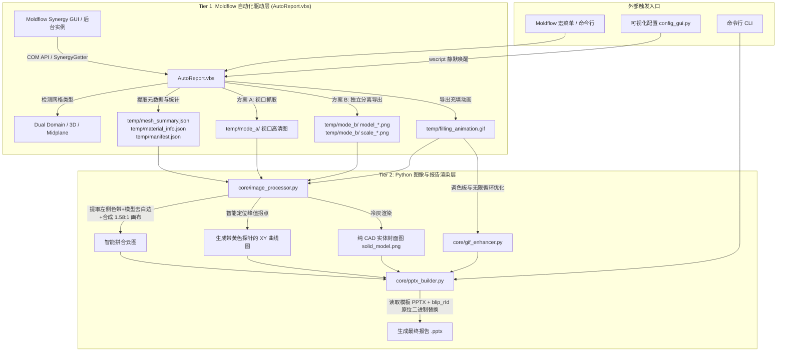

# HYT-MLFXBG AI 开发者接手与技术避坑全景指南 (AI Agent Handover Guide)

> **致未来的 AI 协作者**：  
> 本项目历经多轮实机打磨，攻克了从 Autodesk Moldflow 底层 COM 接口调用、VBScript 跨进程通信、高保真图像拼合到 `python-pptx` 底层 XML 图元操纵的数十个深度隐性技术陷阱。  
> **在修改代码前，请务必完整通读本指南，尤其是第三部分的“10 大核心踩坑经验”！遵循既定模式，切忌盲目推倒重来。**

---

## 🏗️ 一、 系统架构与跨语言协同机制

本项目采用 **双层混合自动化架构 (Two-Tier Hybrid Automation)**：



### 数据契约 (`temp/` 目录规范)
- `manifest.json`：存储方案名、零件名、分析版本、日期等；
- `mesh_summary.json`：包含网格单元数、表面积、体积、纵横比、匹配率百分比（`match_ratio`）；
- `material_info.json`：包含贸易名称、厂家、推荐模温/熔温、最大剪切速率等 14 项材料属性；
- `clamp_force_info.json`：包含 CAE 计算出的最大锁模力吨位 (`cae_max_clamp_force`)；
- `solid_model.png`：专供封面使用的无网格、无节点纯 CAD 冷灰金属质感实体图。

---

## 📁 二、 核心代码拓扑与模块职责

| 文件路径 | 语言/格式 | 核心职责与设计原则 |
| :--- | :--- | :--- |
| [`AutoReport.vbs`](file:///c:/Users/5600/Documents/ZDH/MLFXBG/AutoReport.vbs) | VBScript (GBK) | Moldflow 宏主入口。负责调度 Synergy COM API，导出网格数据、材料参数、视口截图、方案 B 分离切片，最后静默唤醒 Python 处理。 |
| [`OrientModel.vbs`](file:///c:/Users/5600/Documents/ZDH/MLFXBG/OrientModel.vbs) | VBScript (GBK) | 模型定向宏（需求 1）。网格选面后手动运行：面心（几何中心）归零到 0,0,0，面法线对齐 `orient_settings.target_axis`（默认 Z），网格/节点/梁/曲线/CAD 整体旋转+平移（`Modeler.Rotate`/`Translate` + 标签谓词选全部实体）；带确认弹窗与可选保存。 |
| `MakeCoolingCircuit.vbs` / `MakeCoolingCircuit_v1.vbs` | VBScript (GBK) | 冷却水路测试数据生成宏（无冷却水路的研究可用它造数据验证勾选框）。两版并存二选一：带清理+重试+诊断版 / 第一版简单存档（用户实测可用）。**先生成网格再跑**；加水路会让旧分析结果失效（正确顺序：建模 → 分析 → 报告）。 |
| [`config_gui.py`](file:///c:/Users/5600/Documents/ZDH/MLFXBG/config_gui.py) | Python (Tkinter) | 用户图形配置中心。管理 `report_config.json`，提供方案 A/B 单选、30+ 种结果勾选、动图帧数调节，以 `wscript` 零黑框唤醒自动化。 |
| [`report_config.json`](file:///c:/Users/5600/Documents/ZDH/MLFXBG/report_config.json) | JSON (UTF-8) | 系统主配置文件。声明母版路径、输出目录、截图模式（默认 `"B"`）、各分析结果项别名及其对应幻灯片页码。 |
| [`core/pptx_builder.py`](file:///c:/Users/5600/Documents/ZDH/MLFXBG/core/pptx_builder.py) | Python (python-pptx) | PPTX 生成核心引擎。加载母版，通过 `blip_rId` 原位替换图片，严格继承文本框与表格格式，负责自适应满幅排版与页面图元清空。 |
| [`core/image_processor.py`](file:///c:/Users/5600/Documents/ZDH/MLFXBG/core/image_processor.py) | Python (Pillow/NumPy) | 方案 B 专属图像处理流水线。实现色带提取、模型紧致白边裁剪、三维坐标系透明化、XY 曲线拐点定位与黄色探针绘制、纯 CAD 实体生成。 |
| [`core/gif_enhancer.py`](file:///c:/Users/5600/Documents/ZDH/MLFXBG/core/gif_enhancer.py) | Python (Pillow) | 充填时间动图优化器。通过自适应调色板、帧间差分压缩与强制无限循环标记，保证 GIF 体积轻量且播放极其丝滑。 |
| [`PROJECT_SESSIONS.md`](file:///c:/Users/5600/Documents/ZDH/MLFXBG/PROJECT_SESSIONS.md) | Markdown | 跨会话追踪与项目记忆索引。记录历史会话 ID、断点状态与真实存储路径，支持 AI 瞬间重载上下文。 |
| [`使用说明.md`](file:///c:/Users/5600/Documents/ZDH/MLFXBG/使用说明.md) | Markdown | 最终用户操作手册与功能详解。 |

### 治理与契约层（非运行时代码；变更须走 Pull Request）

| 文件 | 作用 |
| :--- | :--- |
| [`AGENTS.md`](file:///c:/Users/5600/Documents/ZDH/MLFXBG/AGENTS.md) + [`AUDIT-SPEC.md`](file:///c:/Users/5600/Documents/ZDH/MLFXBG/AUDIT-SPEC.md) + [`BOOTSTRAP.md`](file:///c:/Users/5600/Documents/ZDH/MLFXBG/BOOTSTRAP.md) | 契约三件套 v2.1.1：铁律 / 行为契约 / 门禁登记 §2 / 红线 + 体检细则 + 部署适配流程。**所有 AI 编码助手进入本项目的唯一标准契约** |
| [`enforcement/`](file:///c:/Users/5600/Documents/ZDH/MLFXBG/enforcement/README.md) | 机械执法层**母版包**（gitleaks / commitlint / Makefile / gate.yml + 四步安装说明），保持可移植、内部文件不与落地实例混同 |
| `.pre-commit-config.yaml` · `commitlint.config.js` · `Makefile` · `.github/workflows/gate.yml` | 执法包在本仓库的**落地实例**；`Makefile` 四个变量已按 §2 填好，`gate.yml` 分支为 `master` |
| [`README.md`](file:///c:/Users/5600/Documents/ZDH/MLFXBG/README.md) | 仓库总入口：快速开始 / 目录结构 / 文档地图 / 门禁命令 |
| [`tests/run_checks.py`](file:///c:/Users/5600/Documents/ZDH/MLFXBG/tests/run_checks.py) | 零依赖回归套件（门禁第 ② 步，无需 Moldflow 与模板） |
| [`check_env.py`](file:///c:/Users/5600/Documents/ZDH/MLFXBG/check_env.py) | 环境预检（依赖 / 配置 / 模板标记，失败附修复指引） |
| [`probe_api.py`](file:///c:/Users/5600/Documents/ZDH/MLFXBG/probe_api.py) | Moldflow API 探针（stdlib；实机模式需已装 pywin32）。解包官方 `help\synapi.chm` 出全量 API 目录、扫描 VBS 实际调用做对照、连实机验证成员可达性并取值；产物 `temp/api_probe/`（不入库） |

> **边界纪律**：`enforcement/` 是母版（空白变量、通用分支名 `main`），
> 根目录同名文件是本项目的已填充实例（`master`、§2 命令）。
> 改动母版要同步全部下游项目；改动实例只影响本仓库。**不要把两者合并成一份。**

---

## ⚠️ 三、 10 大技术陷阱与底层避坑指南 (The Hall of Gotchas)

### 坑 1：VBScript 脚本宿主环境差异与 GBK 乱码危机
* **陷阱表现**：
  1. 在 Moldflow 内部运行宏时，执行 `WScript.Echo` 或 `WScript.Sleep` 会直接报 `Object required: 'WScript'` 崩溃；
  2. 如果将 `AutoReport.vbs` 以 UTF-8 格式保存，VBScript 解释器（默认按系统 ANSI 即 CP936/GBK 读取）会将中文字符串解析成乱码，导致 `InStr(name, "所有效应")` 永远为 0，甚至报语法错。
* **避坑法则**：
  - **绝不直接依赖 `WScript` 对象**：读取脚本路径等属性时，必须包裹 `On Error Resume Next`；如需延时，使用 WshShell 或 Synergy 自带等待；
  - **`AutoReport.vbs` 必须且只能保存为 GBK/ANSI 编码**！编辑该文件时，Python 脚本必须指定 `encoding='gbk'`，严禁使用纯 UTF-8 覆盖；
  - **控制台弹窗抑制**：调用 VBS 时使用 `wscript.exe` 而非 `cscript.exe`；Python 中使用 `subprocess.Popen(["wscript", ...])`，杜绝黑色终端窗口闪烁。

---

### 坑 2：Moldflow COM API `SaveImage3` 色带丢失与视角复位
* **陷阱表现**：
  - 调用 `Viewer.SaveImage3` 导出模型云图时，Moldflow 会丢弃左侧彩条标尺（Legend），只导出孤立的模型；若强制开启标尺，Synergy 又会自动调用 `Viewer.Fit` 强制居中，将模型与标尺挤压重叠在一起，且画质严重模糊。
* **避坑法则**：
  - **采用方案 B 双图独立导出**：
    1. 第一步：隐藏标尺 `Plot.ShowColorScale(False)`，仅导出超大纯净模型 `model_<key>.png`；
    2. 第二步：独立提取标尺图像 `Plot.SaveColorScaleImage(...)` 或从视口裁剪色带 `scale_<key>.png`；
    3. 第三步：在 Python 中通过 Pillow 将二者按 `1.58:1` 黄金比例重构拼合，彻底绕过官方 API 缺陷。
  - **翘曲/变形结果的 ID 探测**：不同版本与语言中，“变形”可能叫“翘曲”、“总变形”或“Deflection”。**切勿单纯依赖字符串匹配**，必须优先使用 `PlotManager.FindDatasetByID(...)` 探测底层 Dataset ID（如 `6250`, `6260`, `6760`, `6770`），并根据 Component ID（0:X, 1:Y, 2:Z, 3:Total）精准创建结果！

---

### 坑 3：python-pptx 图片替换切勿使用 `add_picture`（必须用 `blip_rId`）
* **陷阱表现**：
  - 在 PowerPoint 母版或幻灯片中，如果直接使用 `slide.shapes.add_picture(...)` 添加新图，会导致新图覆盖在文本框上方、遮挡周围元素，且图层 z-order 错乱、尺寸无法严格贴合母版预设。
* **避坑法则**：
  - **利用 `blip_rId` 原位替换图片二进制 Blob**：
    ```python
    rId = pic_shape._element.blip_rId
    rel = pic_shape.part.rels[rId]
    image_part = rel.target_part
    image_part._blob = new_blob  # 直接覆盖底层图片流
    image_part._content_type = "image/png" # 或 image/gif
    ```
  - 这种方式能 **100% 完整保留母版图元的一切属性**（图层顺序、对齐方式、阴影、裁剪边距），真正做到无痕替换！

---

### 坑 4：python-pptx 缺少 `shape.delete()` 方法（底层 XML 节点移除）
* **陷阱表现**：
  - 用户明确要求：“幻灯片 14~16 保留页面与标题，但移除所有图片”。初学者常尝试调用 `shape.delete()` 或 `shapes.remove(shape)`，但 python-pptx 根本没有提供任何高级删除 API，直接引发 `AttributeError`。
* **避坑法则**：
  - **必须直接操作底层 `lxml` 元素进行自脱钩**：
    ```python
    for shape in list(slide.shapes):
        if shape.shape_type == MSO_SHAPE_TYPE.PICTURE:
            sp_elem = shape._element
            sp_elem.getparent().remove(sp_elem) # 安全彻底销毁 XML 节点
    ```

---

### 坑 5：第 2 页网格统计文字挤成一团（段落间距与空行保护）
* **陷阱表现**：
  - 若调用 `text_frame.text = new_text` 或清除段落后重新添加，PPT 会将模板原生内置的段前间距、段后间距、制表位全部重置为紧凑模式，导致原本空行分明的 37 行网格统计数据瞬间挤在一起，视觉体验极差。
* **避坑法则**：
  - **原位段落更新 (In-place Paragraph Update)**：
    使用 [`set_text_frame_keep_text_only`](file:///c:/Users/5600/Documents/ZDH/MLFXBG/core/pptx_builder.py) 算法。如果段落已存在，原位修改 `p.text = line`；保留每节之间的 `""`（空白行），并逐 run 注入字体与字号，100% 还原模板原生排版的“呼吸感”。

---

### 坑 6：第 9 页表格更新字体变成 Calibri（Run 级格式保护）
* **陷阱表现**：
  - 当尝试更新幻灯片表格单元格文字时（如回填 `320.5T`），如果执行 `cell.text = "320.5T"`，Office OpenXML 会将单元格原有的字体样式清空，默认回退成 Calibri 18pt 粗体，破坏原模板的“微软雅黑 12pt”。
* **避坑法则**：
  - **穿透至 `runs[0]` 级别修改文本**：
    ```python
    p = cell.text_frame.paragraphs[0]
    if p.runs:
        p.runs[0].text = text  # 继承原模板的 <a:rPr> 与东亚字体映射 (+mn-ea)
        for extra_r in p.runs[1:]:
            extra_r.text = ""
    ```

---

### 坑 7：XY 曲线最高峰拐点智能探针算法设计
* **陷阱表现**：
  - 锁模力与注射压力 XY 图需要标注最高峰的真实时间与数值。如果通过 OCR 或硬编码坐标，换一个产品方案坐标位置就会偏移，导致标注框飞到图表外。
* **避坑法则**：
  - **基于色彩阈值在目标 ROI 区域内动态扫描黑色像素点**：
    在曲线可能出现峰值的区域（如横向 15%~40%，纵向 8%~32%）扫描暗色像素，提取 `np.argmin(ys)` 找到极值点坐标 `(peak_x, peak_y)`。
  - 在峰值右上方计算排版，绘制经典黄色提示框（`#ffffc8`）、黑色引线与红色圆点，视觉效果与 Moldflow 官方探针完全一致。

---

### 坑 8：PowerPoint 进程文件独占锁 (PermissionError)
* **陷阱表现**：
  - 模流分析工程师经常习惯让生成的 PPT 文件在 PowerPoint 中保持打开状态。当下一次自动化构建执行 `prs.save(output_path)` 时，操作系统会抛出致命的 `PermissionError: [Errno 13] Permission denied`。
* **避坑法则**：
  - **时间戳回退重试机制**：
    捕捉 `PermissionError`，在原文件名后追加时间戳（如 `..._220029.pptx`）并重新保存，确保流程 100% 稳健运行，并在日志中输出温和提示。

---

### 坑 9：Windows 字体缺失导致 `ImageFont.truetype` 崩溃
* **陷阱表现**：
  - 生产代码中直接硬编码 `simsun.ttc` 或 `msyh.ttc`。若用户系统未安装该字体或使用的是非标准精简版 Windows，Pillow 会直接抛出 `OSError: cannot open resource`。
* **避坑法则**：
  - **建立多级字体降级链路**：
    在 [`core/image_processor.py`](file:///c:/Users/5600/Documents/ZDH/MLFXBG/core/image_processor.py) 中封装 `load_truetype_font`，候选顺序：`SimSun` -> `Microsoft YaHei` -> `SimHei` -> `Arial` -> `ImageFont.load_default()`。

---

### 坑 10：充填动画 Shift+F5 提示框被图片覆盖
* **陷阱表现**：
  - Slide 4 插入充填动图时，动图如果面积过大，会直接盖住 PPT 模板右下角的“按 Shift+F5 播放动图”提示文本框。
* **避坑法则**：
  - 在替换动图后，检索包含 `"F5"` 或 `"播放"` 的文本框，锁定其安全坐标，并通过 `sp_parent.append(sp_elem)` 将该文本框节点移动到 slide XML 的末尾（即置于最顶层），彻底消除遮挡。

---

## 🛠️ 四、 常用调试与验证命令速查

```powershell
# 0. 环境自检 (新机器/接手第一步: 依赖/配置/模板标记, 问题附修复指引)
python check_env.py

# 1. 语法与静态检查 (每次改动后必须运行)
python -m py_compile config_gui.py core/gif_enhancer.py core/image_processor.py core/pptx_builder.py

# 2. 零依赖回归测试 (tests/run_checks.py, 无需 Moldflow 与模板)
python tests/run_checks.py

# 3. 方案 B 端到端验证 (最常用; --no-open 不弹 PowerPoint, 产物进 temp)
python core/pptx_builder.py --config report_config.json --data-dir temp --mode B --no-open --output temp\smoke.pptx

# 4. 方案 A / 双方案可选验证 (--output 不能与 BOTH 组合)
python core/pptx_builder.py --config report_config.json --data-dir temp --mode A --no-open --output temp\smoke.pptx
python core/pptx_builder.py --config report_config.json --data-dir temp --mode BOTH --no-open

# 5. 打开配置界面
python config_gui.py

# 6. Git 状态校验 (并核对本地分支相对 origin 的领先/落后)
git status

# 7. 聚合门禁 (§2 四个环节一把梭; 需 make, 由 CI 调用)
make verify

# 8. 密钥与提交信息钩子 (需先 pre-commit install, 见 enforcement/README.md)
pre-commit run --all-files
```

## 🧾 五、 数据完整性与产物判读 (2026-09 优化新增, AI/维护者必读)

### 模板契约 (布局钉死的边界)
- 模板需 ≥2 页: 第 1 页表格含标记文字「报告日期」「Moldflow」(封面回填锚点);
  第 2 页含「实体计数」或「三角」(网格统计回填锚点)。
- `SLIDE_SAFE_BOXES` (pptx_builder.py) 的几何硬编码对应该模板; 更换模板时
  运行会 sha256 对比 `temp/template_hash.txt` 并 WARN, 必须人工核对版式。
- 为何不用 Synergy 自带报告: 交付物是本项目的中文定制 PPT 模板 (既定客户格式),
  自带报告无法产出该版式 —— 这是本工具存在的理由。

### temp/ 产物判读表
| 产物 | 生成者 | 用途 |
|---|---|---|
| run.log | VBS+Python (全链路 GBK) | `=== RUN START <ts> mode= res= ===` 分隔每次运行; 失败看尾部 |
| config_used.json | VBS | 本次运行配置快照 (排查"当时的配置") |
| missing_fields.json | Python | 本次缺失字段清单 (完成弹窗/封面章的依据) |
| peak_values.json | VBS | XY 探针峰值 (null=COM 失败, 绝不写 0); config 手工值回退已删除 |
| *_xy_curve_data.txt | VBS | XY 曲线官方 SaveXYPlotCurveData 导出; 值+时刻由 Python 解析 |
| material_fields.json | VBS | 材料字段官方枚举原始导出 (描述+值), Python 按描述映射 |
| clamp_force_info.json | VBS | CAE 锁模力 (data_complete=false 时 Slide 9 标"数据缺失") |
| template_hash.txt | Python | 模板 sha256 (变更告警) |
| last_output_path.txt | Python | 最后成功输出路径 (运行开始清除, 取消时失效) |

### 退出码语义 (pptx_builder)
`0` 成功; `1` 环境问题 (模板缺失等 FileNotFoundError); `2` 构建失败。VBS 失败弹窗按此解释。

### 已知的平台绑定与降级路径
- `AutoReport.vbs` 的 BaseDir 由 `WScript.ScriptFullName` 自动推导 (随脚本目录走,
  无绝对路径, 换机器/移目录免改); 文件为 GBK 编码 (ANSI), 编辑必须按 GBK 读写, 严禁 UTF-8 覆盖。
- pywin32 移植触发条件 (届时另立项): 再出现任一 VBS 层 bug, 或 Moldflow 大版本升级。
- COM 层失效的降级: 用方式 4 命令行对已有 temp/ 数据离线重构报告 (半手动)。
- ~~待 Moldflow 实机验证项: ExtractPeak 的 GetDepValues/GetIndpValues API~~
  **已证伪 (2026-09-07)**: `Plot.GetDepValues()/GetIndpValues()` 实机调用报错, 已删除。
  XY 峰值现走官方 `Plot.SaveXYPlotCurveData(txt)` 曲线导出 + `Plot.GetMaxValue` 值回退,
  时刻由 Python 从曲线 txt 解析 (image_processor.load_peaks)。
- **MaterialSelector 已禁用 (2026-09-07 实机取证)**: `Synergy.MaterialSelector` +
  `GetMaterialIndex(0)` 在 Moldflow 2023 实机**挂起 16 分钟无返回**。
- **材料锁定 (2026-09-08 实机定案, 推翻旧结论)**: `GetFirstProperty(21000)` 返回的
  是属性表**第一项** — 常驻的"通用 PP : 通用默认"(ID=1, 未用残留), **不是**方案实际
  用材 (实机: 097_1 方案属性表含 ID=2 "Novodur HH-106 : INEOS Styrolution", 求解日志
  097_1_____~1.out 整行记载该材料名, 证明分析用的是它)。旧代码取 ID=1 → 材料页数据
  缺失 + 粘度/PVT 曲线是通用 PP 的。现行锁定三级: ① 工程目录 `<方案基名>~*.out`
  日志按字节精确匹配材料全名 (多日志命中取修改时间最新, GBK↔latin1 字节级 InStr);
  ② 日志不可用 → 属性表中非通用默认的最后一项; ③ 仅通用默认 → 用它 (真用默认料)。
  材料全名格式 "牌号 : 制造商" 由 VBS 拆分导出 (trade_name/manufacturer)。
- **视口截图与数据条 (三次实机取证定案)**: `Viewer.SaveImage` 在 `ShowPlot` 后可能
  输出陈旧帧 → VBS 已在 ShowPlot 后调 `PlotObj.Regenerate` 强制重绘 (取证: 修复前
  多张云图截到同一帧 0.1% 差异; 修复后逐图新鲜 22-24% 差异)。2026-09-08 补齐官方
  导出模式最后一块: `Plot.GetNumberOfFrames()` + `Viewer.ShowPlotFrame PlotObj, N-1`
  (跳到最后一帧, 实机验证可用) + `SleepSec(1)` 等待重绘 — 对应官方 api 文档
  capture_plot_image 示例。
  **`Viewer.SavePlotScaleImage` 实测不可用**: 每次导出同一条 (两两差异 0.4-1.1%),
  且不含标题块 → 数据条唯一主源 = mode_a 视口裁剪 (含标题块+时间+单位+色条+数值,
  裁剪框 (10,8,340,1160) 完整包住图例; 旧框 (50,20,…) 曾切掉标题左缘)。
- **XY 曲线页保持 Moldflow 原生截图 (2026-09-08 用户裁决, 推翻同日"自绘"方案)**:
  Viewer.SaveImage 截到的 XY 图本来就是对的 (半透明模型是 Moldflow 自带效果)。
  曾尝试改为 PIL 自绘 XY 图 — **已撤回**, image_processor 不存在 render_xy_plot。
  峰值探针 = annotate_xy_curves (mode_a + data_dir 两处 Moldflow 原生 XY 图都画,
  方案 A/B 通用, 已含探针的图自动跳过); 峰值值+时刻仍从 peak_values.json/曲线 txt 单源。
- **结果图查找只认精确名 (2026-09-08 用户裁决)**: FindPlotRobust 四层查找
  (精确名/别名/变形模糊匹配/数据集ID猜测) 砍到只剩 `FindPlotByName` 一层。
  起因: 方案里同时存在 "顶出时的体积收缩率" 与 "体积收缩率" 两个结果, 配置
  主名 "顶出时的…" 精确匹配先命中错的那张 — "数据条怎么改都不对" 的根因。
  config 已删全部 aliases; weld_lines 正名 "熔接线" (方案真名)。
  **plot_name 必须与方案结果名一字不差**, 名字来源 = 配置界面 "从 Moldflow 刷新"
  (list_plots.vbs 只读枚举 → temp/available_plots.json); 默认13项刷新后按精确名
  匹配, 命中才勾选, 未命中灰显 "方案中未找到"。页码可在界面 1~16 修改,
  勾选项撞页在保存时弹窗拦截 (find_duplicate_slides)。
- **模型图割裂/贴边 (2026-09-08)**: `Viewer.Fit` 异步生效, Fit 后立即 `SaveImage3`
  曾截到模型贴边/出框的中间态 (mesh 图 2556x923 只剩右半) → Fit 后 `SleepSec(1)`
  再导出; `SleepSec` 用外部 ping 进程实现 (宏宿主内无 `WScript.Sleep`, AI_GUIDE 坑1)。
- **SaveImage3 在 4K 配置下大面积断带 (2026-09-08 实机定案)**: 用户把
  image_settings 改 3840x2160 后, B 案 model_*.png (SaveImage3 离屏导出) 大面积
  渲染残缺 — pressure/vp_switch/flow_front_temp/volumetric 四张全是"模型只剩
  一条横带" (内容高度占比 ~30%, 宽高比 ~2.7); 2560x1440 配置实测正常。
  拼合前三重护栏 (merge_scale_and_model): ① 输出分辨率 != 配置 (参数被无视);
  ② 内容面积占比 <10%; ③ 断带特征 (高度占比 <35% 且宽高比 >2.2)。命中即弃用
  该 model 图、回退视口图直出 (完整正确, 与方案 A 同级), 日志提示检查窗口状态。
  误杀权衡: 天然超宽扁零件可能命中 ③, 但回退图仍完整可用。
- **封面 solid_model.png 双层来源**: VBS 图层隐藏**按网格类型自适应** —
  Fusion/中性面方案的模型本体就是三角形单元 (T), 旧代码无条件隐藏 T 导致导出
  全白空图 (取证 2026-09-08: mode_a/solid_model.png 2560x1440 纯白);
  仅 3D 方案才隐藏 T/TE。Python 侧: 导出空白/缺失时回退
  `generate_solid_cad_model` 灰色重绘。模型导出前 `Viewer.Fit` 全景。
- **材料曲线 CreateMaterialPlot 第二参 = 属性 ID (2026-09-08 实机定案)**:
  传 1 得通用 PP 曲线 (39946B), 传 2 得 Novodur 曲线 (39510B), 传 0 静默无产出
  (2023 实机) — 禁用 0。VBS 用 `ExportMaterialPlotSafe(库, 锁定ID, 字段ID, 路径)`:
  首选锁定 ID, 失败重试一次后回退 ID=1 保底出图并告警。
- **GetFieldDescription 在 2023 实机不支持** (枚举字段描述全空) →
  材料映射走三级: 描述匹配 (高版本可用) → 数值 ID 白名单 → 文本 ID 白名单
  (仅非空非纯数字, 带审计日志)。**旧结论更正 (2026-09-08)**: 方案未必要用
  "通用默认 PP" — 材料文本字段 (系列/制造商等) 是独立字段且对商料也常为空;
  牌号/制造商改由材料全名拆分获得, 数值字段由 ID 白名单补齐。
- **材料数据链路 (2026-09-16 重大修正, 已实机逐值核对)**:
  ① **VBS 调用修正**: 官方属性名是**带参属性 `Prop.FieldDescription(字段ID)`**,
  没有 `GetFieldDescription` 方法 —— 旧写法异常被 `On Error` 吞掉, 导致 desc 恒为空;
  ② **文本字段的"值"就写在 desc 里** (FieldValues 对文本字段为空), 数值字段相反;
  ③ **文本字段 ID 表 (实测, 与材料对话框逐值核对)**: 1991=材料ID(10444)
  1992=系列 1993=等级代码 1994=供应商代码 1995=材料类型 1996=测试日期
  1997=制造商 1998=牌号 1999=材料名称缩写 1633=数据来源 1898=上次修改日期
  1899=数据状态 —— 旧的 1987~1990/20031 整表在实机并不存在 (臆测), 已废弃;
  ④ 映射优先级: **实测文本 ID 表 > 描述关键字 > 数值 ID 白名单**
  (顺序不可颠倒, 否则"数据来源"的长文本会被"制造商"关键字抢先命中);
  ⑤ 仍拿不到: "测试日期"(材料本身为空) 与 "纤维/填充物" (材料对象里无此字段,
  官方对话框的"未填充"是其派生态); 数值字段白名单 LEGACY_FIELD_IDS
  (1808/1800/1807/1801/11002/11108/1504/1804/1806) 不变。
- **注塑机最大锁模力无 COM 通道**: 官方对象模型无 machine/tonnage 读取 API
  (已对 Autodesk moldflow-api 全量源码 grep 核实)。XY 图 Y 轴上限是自动取整刻度
  (非机台字段), 拿它当吨位会再次臆造 → 只能 GUI 高级设置人工录入 (配置持久化)。
- **封面角章已按用户裁决移除**: 数据完整性缺失清单只在完成弹窗与
  temp/missing_fields.json 呈现, 不再印进报告图面。
- **temp/ 数据契约新增**: `material_fields.json` (材料字段原始枚举)、
  `*_xy_curve_data.txt` (XY 曲线官方导出)、`part_name` (manifest, 来自
  `StudyDoc.GetPartCadNames`)。VBS 启动时清理全部数据 JSON 与派生缓存
  (`solid_model_cover.jpg`/`mesh_model_cropped.png`), 防上个产品数据漏入。
- **报告模板残留**: 模板是已填写的旧产品报告, "结果说明"类行是旧产品结论,
  构建时统一清空 (`clear_stale_conclusion_rows`); "分析要求"为通用标准, 保留。
  config 中 `inj_pressure_settings`/`clamp_force_settings.cae_max_ton` 等
  手工峰值回退已删除 (换产品后冒充本次数据, 实发事故), 峰值只认本次导出。
- **API 探针 (`probe_api.py`, 2026-09-16 新增)**: 官方 API 目录来源 =
  `<Moldflow 安装目录>\help\synapi.chm` (Doxygen, 2023 = 41 类 / 906 成员)。
  解包必须用 **32 位** `%SystemRoot%\SysWOW64\hh.exe` (64 位静默 0 输出), 且 CHM
  位于 Program Files 时须先复制到无空格路径。`python probe_api.py` = 全量目录 +
  VBS 用法对照 (无需 Moldflow); `--live [--invoke] [--cross-probe] [--temp-project]
  [--start]` = 实机探测, 产物 `temp/api_probe/{catalog,audit,live}.{json,md}`。
  **`--invoke` 只调"只读属性 + 零参 Get/Is/Has"**, 其余一律跳过 — 曾因批量调用
  `Viewer.Print` 弹"保存 PDF"对话框把实机卡死 (2026-09-16 事故); `--temp-project`
  已幂等 (工程名带时间戳 / 复用已打开工程), 避免同名工程重复弹窗。
  实机探测须人在场 (Moldflow 自身弹窗是模态的, 客户端无法干预)。
- **2023 实机核对结论 (探针取证, 2026-09-16)**:
  - 文档有 / 实机无 (6 项): `Synergy.CreateStringArrayAuto`、`Synergy.ExportStructFiles`、
    `Project.OpenItemCompareMode`、`Modeler.SetMeshSize3`、
    `MoldSurfaceGenerator.CADMergeTolerance`、`JobMgr.JobMgr`;
  - `GetObject(, "Synergy.Synergy")` 在外部进程取不到运行实例 (ROT 无登记) —
    AutoReport.vbs 的 SAInstance→GetObject→CreateObject 三级兜底确有必要;
  - `Property` 的官方名字是**带参属性** `FieldDescription(字段ID)` /
    `FieldUnits(字段ID)` (StringArray), **没有** `GetFieldDescription`;
    2023 材料库 (21000) 数值字段的 `FieldDescription` 仍返回空串 →
    材料描述匹配注定空跑, 继续依赖 `LEGACY_FIELD_IDS` 白名单;
  - 未开发通道 (文档存在, 用前需实机验证): `PlotMgr.GetScalarData/GetVectorData/
    GetTensorData` 可直接取数值数组; `Plot` 的 XY 轴/图例/色带参数近百项;
    `DiagnosisManager` 65 个网格诊断方法 (仓库仅用 1 个);
    `Viewer.GetViewSizeX/Y` 可读视口尺寸;
  - 坑 2 提到的 `Plot.ShowColorScale` / `Plot.SaveColorScaleImage` **未见于 2023
    官方目录**, 引用前须实测 (现有代码实际走 `Viewer.SavePlotScaleImage`)。
- **模型定向宏 `OrientModel.vbs` (需求 1, 2026-09-16, 第二版)**: 前置 = 网格显示下点选
  一个三角形面。算法: 面心 = 选中面节点包围盒中心; 面法线 = 三角形叉积求和 (绕向即朝向,
  `orient_settings.flip_normal` 可翻转); 旋转轴 = `N x T`、角度 = `arccos(N·T)`,
  绕面心 `Modeler.Rotate` 后 `Modeler.Translate(-面心)`, `aMerge=False` (避免合并掉
  重合节点上的实体)。
  **⚠️ 头号坑 (2026-09-16 实机踩到两轮, 最终定案)**: 曲线 (C) 与梁 (B) **共用节点** —
  实测"只移曲线 +10mm"时梁的节点也一起移动。因此:
  - `CreateLabelPredicate` 的字符串**一次只能带一个范围** (`"N1:N9999999 T1:T9999999"`
    只有第一个生效; 组合串实测只选中 43842 节点, 漏掉 87564 三角形与全部梁/曲线);
    `SelectFromPredicate` / `SelectFromString` 均为**替换**语义 (连调两次不累加);
  - **分趟按类型移动会把共用节点移动两次** → 模型错乱 (实测: 梁节点被移到 T(T(p0)),
    与曲线点不再重合)。**禁止分趟**;
  - 正确做法 = **全选 + 单次变换**: `PredicateManager.CreateBoolNotPredicate(
    CreatePropTypePredicate(999999))` (不存在的属性类型 -> 空谓词 -> 取反得到全部实体,
    实测一次选中 **131493 个实体**), 然后一次 `Translate(-面心)` + 一次
    `Rotate(center=(0,0,0), axis, angle)`。实测全套 **0.45s + 0.72s**;
  - 该"空谓词取反"是唯一可用的全选手段: 空 EntList / 层列表 (L1..Ln) / 多范围串均无效
    (实测传空表或层列表给 Translate/Rotate 都是 0 位移);
  - **CAD 几何 ("CAD 几何" 文件夹里的本体) 在 API 实体空间之外, 无法自动旋转**
    (2026-09-16 定案, 证据链): ① 5 种 CreateEntityList 的全选谓词均为 131493
    (= 节点+三角形+梁+曲线+NBC), 无一 CAD 实体; ② `F/BD/S/STL/R` 前缀指数探测到
    200 万 ID 全为 0; ③ 图形窗口里点选 CAD 后 `StudyDoc.Selection` 仍为 0;
    ④ **宏上下文对照试验**: %SAInstance% 正常、`" N1 "`/`" FD1 "`/`" L2 "` 均解析为 1,
    而 `" BD1 "` / `" BD1 BD2 BD3 BD4 "` 恒为 0 —— 解析器工作正常, CAD 就是够不着;
    ⑤ 宏录制器虽然输出 `SelectFromString " BD1 BD2 BD3 BD4 "` + `Modeler.Rotate`,
    但回放时该选择为 0 (静默空转), 说明 GUI 走的是进程内私有通道。
    结论: **CAD 只能由用户在 GUI 里手工旋转**; 宏会在 `temp/orient.log` 里打印
    可照抄的参数 (参考点 (0,0,0) / 轴向量 / 角度)。宏内保留 BD 探测趟的意义是
    "未来版本若放开即自动生效"。封面图因探测不到 CAD 实体, 自动退化为网格本体
    (与旋转后的模型一致, 不会错位)。
  - 谓词不支持 `F`/`BD` 前缀 (报 0x80020008), 但已在 CAD 趟单独处理。
  实体列表用 `StudyDoc.CreateEntityList()` 建 (官方注: `Modeler.CreateEntityList` 会先弹
  结果失效询问)。脚本跑完会写 `temp/orient_before.png` / `orient_after.png` 供人工对照,
  并把面心/法线/各趟实体数与变换结果、变换后复核偏差写进 `temp/orient.log`。
  **操作顺序 (v3, 2026-09-16 用户定案)**: 复刻 GUI 手工流程 — 每趟都是
  `Translate(-面心)` 先把面心挪到原点, 再 `Rotate(center=(0,0,0), axis, angle)` 绕原点旋转;
  等价于绕面心旋转, 但和用户"参考点就是 0,0,0"的手工操作一致。
  **实机取证 (2026-09-16, 副本对照法)**:
  - 用同一批实体 ID 在两份研究里比对"预测位置 + 两两距离"(刚体变换不变量):
    节点/三角形/梁(B) 均正确跟随 (残差 0.0mm), 而 **曲线(C) 由控制点定义, 不随节点变换,
    必须单独一趟** (漏掉会让包围盒被撑大, 注射位置等按包围盒缩放的标识会显示成"巨大"
    — 这就是用户报障的根因); 曲线趟实测残差 0.0mm;
  - **不会变形**: 任意轴 96.88° 大角度旋转前后, 40 个三角形面积零变化 (>0.1% 差异 0 个);
    v1 的"变形"来自 `aMerge=True` 合并了重合节点, 现已全程 `aMerge=False`;
  - **耗时真相**: 43842 节点 `Rotate` 实测 **0.5~0.7s**(不是分钟级)。此前一次 452s 是
    "研究里带分析结果时, 首次改模型引发结果失效"的一次性成本; 副本(0 结果文件)同参数
    仅 0.5s。宏的确认弹窗已写明"首次可能等待几分钟, 勿中断"。
  脚本不做任何保存 (用户定案: 默认不保存, 手动存)。
- **实体显示 (冷/热流道/冷却水路) 按属性分类重构 (需求 3, 2026-09-16 实机取证)**:
  旧实现把三个勾选框合成了一个开关 (任一勾选即把 B/C 全放出来) 且按类型一刀切。
  实测结论: 这些实体都是梁(B)/曲线(C), **靠类型无法区分**, 但**属性类型可以**:
  热流道=40430、热浇口=40434、热主浇道=40442; 冷却液入口=40020、管道=40480
  (零件表面=40801, 注射位置=40000; 冷流道属性在有冷流道的研究里按同样方式可被识别)。
  新实现 (`ScanEntityCategories` + `ApplyEntityVisibility2` + `RestoreEntityVisibility2`):
  扫描 TsetID 40000-40999 取属性名 -> 中英文关键字归类 (热流道/冷流道/冷却) ->
  用 `CreatePropTypePredicate` + `CreateBoolOrPredicate` 选出各类实体 ->
  经 `StudyDoc.GetEntityLayer` + `LayerManager.GetName` 汇总各类所在图层 ->
  **逐层设置该层 B/C 可见性** (勾选=显示, 未勾=隐藏), 截图后按快照恢复;
  **不移动任何实体** (早期"挪到临时图层"方案会改动图层归属, 已弃用)。
  同一图层被多类共用时只能一起显隐, 日志会告警 (要完全独立需拆图层)。
  实测有效性: 全显示 vs 全不勾选像素差 0.45%; 勾选后能按类恢复显示。
  VBScript 保留字坑 (2026-09-16 各踩一次): `shared` 与 `me` 都是保留字,
  `Dim shared` / `Dim ... me ...` 直接编译报错 ("缺少标识符"), 命名时避开。
  **数组声明时机坑 (同日实机踩到)**: 顶层 `Dim x(2)` 不是编译期分配, 而是**执行到那一行
  才分配**; 若把声明放在脚本末尾 (主流程 `WScript.Quit` 之后), 主流程里调用子过程访问该数组
  会报 "类型不匹配: 'x' (800A000D)"。带维度的数组声明必须放在主流程之前 (本项目统一放在
   脚本顶部 Dim 区)。两类坑均已有门禁兜底: `tests/run_checks.py::test_vbs_declared_variables`
   按过程作用域静态扫描"用了但没声明"的变量 (含 Set / For 赋值), 误报白名单含过程自身名
   (VBScript 用"过程名 = 值"返回结果)。
- **冷却水路生成 (测试数据宏 `MakeCoolingCircuit*.vbs`, 2026-09-16 实机取证)**:
  走官方 `Synergy.CircuitGenerator()` (属性 `Diameter/Distance/Spacing/Overhang/NumChannels/`
  `UseHoses/XAlign/DeleteOld` + 无参 `Generate()`)。实测:
  - **有网格的研究上生成成功** (Generate=True, 128 实体 = 126 管道 + 2 冷却液入口, 直径 8/距离 25/3 通道);
  - **没有网格的研究 (日志 `MeshStatus=New`) 上 v2 半途抛 COM 异常 #-2147417851 (RPC_E_SERVERFAULT)**,
    异常前已建出 86 实体 (84 管道 + 2 入口) → 会留下"半截水路", 需先删再重生成
    (v2 清理步骤实测可用: `40480∪40020` 谓词 + `MeshEditor.Delete`, 一次清掉 464 残留);
  - **运行时序铁律**: 生成水路 = 改模型 → Moldflow 立即作废已有分析结果 (报告随即全部"图像缺失",
    现场证据 `temp/available_plots.json` = 研究 0 个绘图)。官方 API 里没有任何"保留结果"开关
    (仅 `DeleteResults`/结果导出类), **唯一解法是顺序**: 建模(水路/流道/定向) → 跑分析 → 出报告;
  - 报告取图只看研究里现存**绘图对象** (`PlotManager.GetFirstPlot/GetNextPlot` 枚举), 找不到即跳过
    并写缺失占位 — 判断"研究有没有图"看 `temp/available_plots.json` 即可。
- **实体显示 4 类化 + 每页独立 + 取景归一 (2026-09-17 需求 1/2/3, 全部 API 经 CHM 取证)**:
  - **注射位置 (TsetID 40000) = 第 4 类**: 它是 **NDBC (节点边界条件)** 实体, 图层类型码是
    **"NBC"** —— 不是 "N"(节点)。官方类型表取证 (CHM classLayerManager):
    `N: Node B: Beam T: Triangle C: Curve S: Surface R: Region NBC: NDBC SBC: SUBC LCS: LCS TE: TET4 STL: STL`
    (+ `F: Face`)。实机实例名: `热塑性塑料工艺注射位置(默认)` → 1 个实体, 图层=默认层。
    2026-09-17 教训: 上一版按 "N" 控制 → 完全不生效 (N 是网格节点, 与 NDBC 图标无关)。
    语义按用户定案:**勾选 = 强制显示 NBC; 不勾选 = 绝不改动**
    (`ApplyEntityVisibility2` 体内禁止出现 `SetTypeVisible ..., "NBC", False` — 已加静态门禁);
    **结尾写回时若本次运行勾选了显示, 则保持 NBC 可见** (`RestoreEntityVisibility2(keepInjVisible)`,
    用户定案: "跑完注射位置图标不能消失"; 不勾选才按快照原样写回)。
  - **实体显示的应用时机 (2026-09-17 实机取证)**: 必须在 `Viewer.ShowPlot` + `PlotObj.Regenerate`
    + `ShowPlotFrame` **之后**再调 `ApplyEntityVisibility2` —— 绘图自带的显示状态会覆盖图层
    类型可见性。现场证据: 同一份配置下, 压力页截图有黄色注射位置锥标, 下一张 V/P 页就没有了,
    后面全部没有; 两页之间脚本动作完全一致, 唯一变量就是"每次 ShowPlot 会重置显示状态"。
  - **每页独立显示**: `plots[i].display = {cold_runner, hot_runner, cooling_channels, injection}`,
    缺字段 → 继承全局 `entity_display` (对应关系表 `config_gui.PLOT_DISPLAY_TO_ENTITY`,
    字段名由 `tests/run_checks.py::test_plot_display_fields_align_vbs` 做跨语言逐字校验)。
    VBS 侧: `SnapshotEntityVisibility()` 只做一次快照(条目 = 图层×类型, 记录所属类别清单),
    `ApplyEntityVisibility2(showHot, showCold, showCool, showInj)` 在**每个结果页截图前**调用,
    截图循环结束统一 `RestoreEntityVisibility2()` 按快照还原。
  - **取景归一 (与用户缩放解耦)**: 官方 API 语义已核 —
    `Viewer.Fit()` = 模型铺满窗口; `Viewer.Zoom(系数)` = 按系数缩放(0.9 = 再缩 10%);
    `Viewer.Rotate(x,y,z)` = **绝对角**, `RotateBy` 才是相对角(故还原直接写回原角度);
    `Viewer.CreateBookmark/GoToBookmark/DeleteBookmark` = 视角存取(含缩放/平移);
    `Viewer.GetActivePlot()` = 当时显示的绘图。流程: 读 `capture_settings` + 每页 `view_settings`
    (rotation/zoom/fit, 单页优先) → Rotate(可选) → Fit → Zoom(≠1 时) → 截图 → 写回原角度;
    脚本开头打书签 + 记录活动绘图, 结尾 `GoToBookmark` 还原视角、隐藏本脚本显示的绘图并
    `ShowPlot PrevActivePlot` 还原用户原来的显示。
  - 相关文件: `config_gui.py` 的 `ENTITY_DISPLAY_DEFAULTS` / `get_capture_settings` /
    每行"显示 冷 热 水 注"小勾(改过即定制, 不再跟随全局); `report_config.json` 的
    `entity_display.show_injection`(默认 true) 与 `capture_settings`(fit/zoom/restore_view)。
  - **封面 / Slide 2 网格图 = 按类型分离 (2026-09-17 需求 3 修订, 用户指出的正解)**:
    旧方案枚举 BD/F 标签与 S 谓词找 CAD 实体句柄 —— CAD 实体在 API 里选不中, 于是永远走
    "研究无 CAD" 退化分支, 结果封面只能拿网格模型, 而 **Slide 2 的网格图里反而混进了 CAD 本体**。
    新方案不需要实体句柄, 纯按图层类型切:
    - 封面 `solid_model.png` = `SetCadTypesMode(True)`: 只留 `S/F/STL/BD`, 网格(T/TE)/梁/曲线/
      节点/边界(NBC/SBC)全隐藏 → 截出的就是纯 CAD 本体; 研究没 CAD 时该图接近空白,
      由 Python `resolve_cover_image` 的候选链自动回退 (视口模型裁剪) —— 空图不会误当封面;
    - Slide 2 `mesh_model.png` = `SetMeshOnlyVisible()`: **白名单 = T/TE/N**(网格与节点, 用户定案
      2026-09-17「只要 CAD 模型生成的网格和节点」), 其余类型(梁 B=流道/水路、曲线 C、CAD 面
      S/F/STL/BD、NBC/SBC、R/LCS)全部隐藏。**踩过的坑**: 早先网格趟只"关 CAD 类型", 而封面趟
      已把所有类型关光 → 网格还停在关闭状态, 截出全白图; 现在网格趟用完整白名单显式设定, 不再依赖
      前一趟的残留状态;
    - 两趟共用一份图层快照 (`LayerSnap`, 13 类型 × 全部图层), 末尾 `RestoreLayerSnapAll()` 统一写回。
    `EnumerateCadSpec` 函数保留但已不在截图链路调用 (历史方案留档)。
  - **注射位置最终态保护 (2026-09-17 第三次反馈后加)**: 用户第三次反馈"跑完软件里图标仍不显示"。
    既然截图里 NBC 强制显示有效(已实机验证), 疑点转为**结尾的绘图/视角还原把显示状态又盖回去**
    (实机已证: 每次 ShowPlot 会用绘图自有显示状态覆盖图层可见性)。因此新增
    `EnsureInjectionVisible()`: 在 `HidePlot`/`ShowPlot PrevActivePlot`/`GoToBookmark` **全部做完之后**,
    对注射位置所在图层做 `SetTypeVisible(layer,"NBC",True)` + `SetTypeShowLabels(layer,"NBC",True)`,
    并把复核值 `GetTypeVisible(layer,"NBC")` 写进日志 —— 日志里 `注射位置最终态: ... 复核=True`
    即代表脚本侧已尽力(若仍不显示则说明另有关闭开关, 按日志继续排查, 不做无据猜测)。
  - **标签坑 (2026-09-17 实机翻车)**: 曾用 `SetTypeShowLabels(layer, "NBC", True)` 想"顺带把注射位置
    标签显示", 结果**把 N/B/C 三类标签全打开了** (用户截图满屏 `N99757`/`B87565`/`B87576`...)。
    结论: 该接口的 aType 匹配比预期宽松, **不要用 "NBC" 这类组合串调它**; 且标签状态**没有 getter**
    (只有 setter), 无法快照还原 → 只能按"默认关"一次性清理: 新增 `CleanupEntityLabels()` 在脚本
    开头对 N/B/C/NBC 四类设 False (日志 `标签清理: ...`)。
  - **注射位置显隐语义修订 (用户定案 2026-09-17)**: 原"未勾选=绝不动它"改为**按页显隐** ——
    `SetTypeVisible(layer, "NBC", checked(3))` (与冷/热/水一致); "跑完软件里保持显示"由全局勾选 +
    结尾 `EnsureInjectionVisible()` 兜底, 两者不再冲突。
  - **决定性修复: 实体"真隐藏" = 临时隐藏层 (2026-09-17, 三次反馈后定案)**:
    实机证据链: 配置与应用值都正确 (13~16 页四项全 False, 日志可查), 但**视口截图仍显示实体**
    —— 说明 `SetTypeVisible` 的**图层类型可见性对视口渲染无效**(离屏导出倒是认, 但离屏又丢面)。
    用户自己的验证给出了唯一可靠通路: **视口认"图层隐藏"**(CAD/网格分离截图就是靠它)。
    实现: 每类一个临时层 `MLFX_TempHide_0..3` (建层即 `ShowLayers False`), 隐藏时
    `AssignToLayer(类别谓词选出的整类实体, 临时层)`, 还原时用
    `CreateBoolAndPredicate(类别谓词, CreateLabelPredicate("L<原图层名>"))` 逐组挪回原图层,
    残留实体兜底挪回该类第一原层并告警, 最后 `DeleteLayer` 清掉临时层。
    调用点: `SnapshotEntityVisibility` 末建层 -> `ApplyEntityVisibility2` 内按 `checked(ci)` 挪动
    -> 结尾 `RestoreEntityPlacement()`。
    **残留风险 (已文档化)**: 中断/取消导致未还原时, 研究里会留下 `MLFX_TempHide_*` 图层,
    把实体挪回原图层后删层即可。
  - **模型来源定案 (2026-09-17 两轮往返)**: 离屏优先 -> 用户反馈 5/6/8/11 页"图片不完整"
    (SaveImage3 丢面/只渲染局部); 最终**视口优先** (恒完整) + 离屏兜底且必须过
    分辨率/面积比/断带/割裂四道校验。实体混入与缩放标尺问题改由上面的"真隐藏"在源头解决。
  - **性能实测与提速 (2026-09-17)**: 一次完整运行 135s, 构成为 Moldflow 侧渲染(动画 31s / 11 页截图 39s /
    封面+网格 14s / 实体扫描 9s) + Python 侧 12s (A 3.5s + B 8.1s)。已做两项安全优化:
    (a) 根目录结果图副本改用 `FSO.CopyFile` 复用 mode_a 同图 (省每页一次离屏渲染, ~10s);
    (b) `_GIF_OPTIMIZED_STAMPS` 按 (路径,mtime,size) 去重, 双方案不再二次优化同一 GIF (~2.5s,
    同时避免重复量化掉画质)。未动: 属性 ID 全范围扫描(1000 次 COM 调用 ~7s, 保留全扫以免漏新类型)、
    防陈旧帧的 `SleepSec(1)`、2560×1440 离屏导出(用户可在 GUI 调低分辨率换速度)。
  - **VBScript 字面量坑 (2026-09-17 实机编译报错)**: `CapZoom = 1#` 里的 `#` 双精度后缀
    **VBScript 不支持**(那是 VB6/VBA 语法), cscript 报"错误未定义"; 一律写 `1.0`。
    已有回归守卫 `test_vbs_capture_framing_normalized` 断言全书无 `1#`。
  - **已知限制 (API 无 getter, 不臆造)**: 封面抓图前会 `LayerManager.ShowAllLayers` 把所有图层置可见
    (否则用户手工隐藏的 CAD 图层抓不到), 而 API **只提供** `GetTypeVisible(层, 类型)`, **没有**
    "图层整体是否可见"的读取接口 (`ShowLayers/HideAllOtherLayers` 都只有 set 语义, 无法快照),
    因此跑完脚本不会恢复"你手工隐藏了哪几个图层"这一状态 —— 文档已如实告知用户, 不用猜测值糊弄。

- **XYZ 变形页默认出图 (2026-09-16 用户定案)**: `report_config.json` 中
  `warpage_x/y/z.enabled=true` (X/Y 视角 (0,0,0), Z 视角 (-90,0,0)), GUI 默认勾选清单同步加入;
  `pptx_builder` 里"第 14~16 页为保留页、不放结果图"的限制**已整体取消** (页内占位图将被
  真实结果图替换, 无图则插入; 安全框沿用第 13 页规格)。历史: 2026-09-08 曾默认不勾选,
  2026-09-09 体检 B-03 仅要求"静默丢弃须登记", 现按用户定案恢复出图。

- **变形图视角数据驱动 (需求 2, 2026-09-16)**: `AutoReport.vbs` 读每个 plot 的
  `view_settings.rotation=[rx,ry,rz]`(绝对角度, 官方另有 `RotateBy` 证明 `Rotate` 是绝对)
  与 `view_settings.fit`, 截图后恢复原视角; 缺配置时仅 `warpage_z` 回落 (-90,0,0)。
  默认值: x/y = (0,0,0), z = (-90,0,0), 全部可在 `report_config.json` 手改。
- **封面模型图改为"只显示 CAD 图层" (需求 3 第一步, 2026-09-16, 第二版)**: 旧实现按类型
  全局隐藏/显示且 `TypeToShow` 含 `C`, 导致流道/水路曲线混进封面, 且快照只取第一层、
  恢复时把第 1 层的可见性写进所有层。新实现:
  1) CAD 实体定位 = `BD` 逐号枚举 (`EnumerateCadSpec`, 谓词不支持 `BD/F` 前缀) →
     失败再枚举 `F` → 再失败用谓词选 `S`(曲面); 由 `StudyDoc.GetEntityLayer` +
     `LayerManager.GetName` 汇总 CAD 图层名;
  2) 非 CAD 层全部类型置 False, CAD 层只留 `S/BD/F/STL`;
  3) **研究里没有 CAD 实体时 (Fusion/STL 网格工程) 退回"只显示模型本体 T/TE"** —
     否则封面会空白 (2026-09-16 实机清点证实: 典型 Fusion 工程 S/R/STL/BD/F 全为 0);
  4) 逐层快照/恢复 (LayerSnap, 上限 512 层)。
  另注: 实机清点 (`python probe_api.py --study-inventory`) 显示流道/水路可能都放在
  "默认层" (与 CAD/网格混层), 因此**不能按图层名识别流道/水路**, 只能按实体类型/属性。

---

## 🧠 六、 记忆加载与会话接手准则

当你在新会话或重启后进入本项目时：
1. **第一步**：读取根目录的 [`PROJECT_SESSIONS.md`](file:///c:/Users/5600/Documents/ZDH/MLFXBG/PROJECT_SESSIONS.md)，获取当前活跃的 Conversation ID 与断点历史；
2. **第二步**：查阅本文档 [`AI_GUIDE.md`](file:///c:/Users/5600/Documents/ZDH/MLFXBG/AI_GUIDE.md) 了解架构规范，严格遵循上述 10 大避坑法则；
3. **第三步**：完成新功能的开发或修复后，同步在 [`PROJECT_SESSIONS.md`](file:///c:/Users/5600/Documents/ZDH/MLFXBG/PROJECT_SESSIONS.md) 的断点清单中勾选归档。

---

## 🧱 七、 契约与机械执法层 (Enforcement)

> 本文档管"怎么改不出错"，`AGENTS.md` 管"必须怎么改"。二者关系：**文档管行为，钩子兜底线**。

### 7.1 三层结构（别混同）

| 层 | 文件 | 可移植性 |
| :--- | :--- | :--- |
| 契约层 | `AGENTS.md` / `AUDIT-SPEC.md` / `BOOTSTRAP.md` (v2.1.1) | 通用母版，随项目拷贝 |
| 执法母版 | `enforcement/`（4 个模板 + README） | 通用母版，**变量留空、分支写 `main`** |
| 落地实例 | 根 `Makefile` / `commitlint.config.js` / `.pre-commit-config.yaml` / `.github/workflows/gate.yml` | 本仓库专属，变量按 §2 填好、分支 `master` |

### 7.2 覆盖对照（哪些红线真的机械化了）

| 契约规则 | 执法手段 | 覆盖程度 |
| :--- | :--- | :--- |
| R-0.4 禁止泄露密钥 | gitleaks pre-commit + CI | **部分**：密钥类覆盖；内网域名 / 连接串须自定义规则或人工审查 |
| R-3.8 原子提交 / Conventional Commits | commitlint（commit-msg 钩子） | 完整（需 `pre-commit install --hook-type commit-msg`） |
| R-0.1 未验证不交付 | `make verify`（CI 侧） | 聚合门禁；本地 Windows 需逐条执行 §2 |
| §2 主干保护 | branch protection + gate CI | 依赖 GitHub 侧配置（Settings → Branches） |

**未机械化、仍靠纪律的红线**：R-3.1 吞异常、R-3.2 放宽断言、R-3.3 调试残留、
R-3.10 最小改动 —— 由提示词纪律 + 人工审查 + `/audit` 体检兜底。

### 7.3 状态与操作

- 已落地：4 个实例文件已入库，`Makefile` 变量与 §2 对齐。
- **未激活**：`pre-commit` 框架与 commitlint 的 npm 包**尚未安装**（属新增依赖，R-3.5 须授权）。激活命令见 `README.md` 第四节。
- **本机 Windows 无 `make`**：本地闭环按 §2 三条命令 + 冒烟逐条执行并附退出码；`make verify` 由 `gate.yml` 在 ubuntu runner 上跑。
- 升级 gitleaks：`pre-commit autoupdate`。
- 分支保护需在 GitHub 仓库侧勾选（Require PR / Require status checks `gate` / Block force pushes）。
