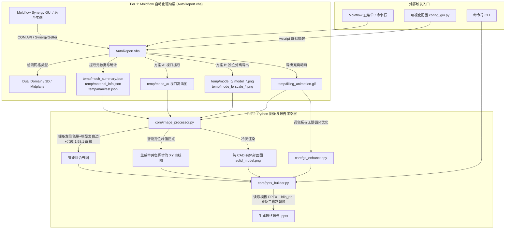

# HYT-MLFXBG AI 开发者接手与技术避坑全景指南 (AI Agent Handover Guide)

> **致未来的 AI 协作者**：  
> 本项目历经多轮实机打磨，攻克了从 Autodesk Moldflow 底层 COM 接口调用、VBScript 跨进程通信、高保真图像拼合到 `python-pptx` 底层 XML 图元操纵的数十个深度隐性技术陷阱。  
> **在修改代码前，请务必完整通读本指南，尤其是第三部分的“10 大核心踩坑经验”！遵循既定模式，切忌盲目推倒重来。**

---

## 🏗️ 一、 系统架构与跨语言协同机制

本项目采用 **双层混合自动化架构 (Two-Tier Hybrid Automation)**：



### 数据契约 (`temp/` 目录规范)
- `manifest.json`：存储方案名、零件名、分析版本、日期等；
- `mesh_summary.json`：包含网格单元数、表面积、体积、纵横比、匹配率百分比（`match_ratio`）；
- `material_info.json`：包含贸易名称、厂家、推荐模温/熔温、最大剪切速率等 14 项材料属性；
- `clamp_force_info.json`：包含 CAE 计算出的最大锁模力吨位 (`cae_max_clamp_force`)；
- `solid_model.png`：专供封面使用的无网格、无节点纯 CAD 冷灰金属质感实体图。

---

## 📁 二、 核心代码拓扑与模块职责

| 文件路径 | 语言/格式 | 核心职责与设计原则 |
| :--- | :--- | :--- |
| [`AutoReport.vbs`](file:///c:/Users/5600/Documents/ZDH/MLFXBG/AutoReport.vbs) | VBScript (GBK) | Moldflow 宏主入口。负责调度 Synergy COM API，导出网格数据、材料参数、视口截图、方案 B 分离切片，最后静默唤醒 Python 处理。 |
| [`config_gui.py`](file:///c:/Users/5600/Documents/ZDH/MLFXBG/config_gui.py) | Python (Tkinter) | 用户图形配置中心。管理 `report_config.json`，提供方案 A/B 单选、30+ 种结果勾选、动图帧数调节，以 `wscript` 零黑框唤醒自动化。 |
| [`report_config.json`](file:///c:/Users/5600/Documents/ZDH/MLFXBG/report_config.json) | JSON (UTF-8) | 系统主配置文件。声明母版路径、输出目录、截图模式（默认 `"B"`）、各分析结果项别名及其对应幻灯片页码。 |
| [`core/pptx_builder.py`](file:///c:/Users/5600/Documents/ZDH/MLFXBG/core/pptx_builder.py) | Python (python-pptx) | PPTX 生成核心引擎。加载母版，通过 `blip_rId` 原位替换图片，严格继承文本框与表格格式，负责自适应满幅排版与页面图元清空。 |
| [`core/image_processor.py`](file:///c:/Users/5600/Documents/ZDH/MLFXBG/core/image_processor.py) | Python (Pillow/NumPy) | 方案 B 专属图像处理流水线。实现色带提取、模型紧致白边裁剪、三维坐标系透明化、XY 曲线拐点定位与黄色探针绘制、纯 CAD 实体生成。 |
| [`core/gif_enhancer.py`](file:///c:/Users/5600/Documents/ZDH/MLFXBG/core/gif_enhancer.py) | Python (Pillow) | 充填时间动图优化器。通过自适应调色板、帧间差分压缩与强制无限循环标记，保证 GIF 体积轻量且播放极其丝滑。 |
| [`PROJECT_SESSIONS.md`](file:///c:/Users/5600/Documents/ZDH/MLFXBG/PROJECT_SESSIONS.md) | Markdown | 跨会话追踪与项目记忆索引。记录历史会话 ID、断点状态与真实存储路径，支持 AI 瞬间重载上下文。 |
| [`使用说明.md`](file:///c:/Users/5600/Documents/ZDH/MLFXBG/使用说明.md) | Markdown | 最终用户操作手册与功能详解。 |

---

## ⚠️ 三、 10 大技术陷阱与底层避坑指南 (The Hall of Gotchas)

### 坑 1：VBScript 脚本宿主环境差异与 GBK 乱码危机
* **陷阱表现**：
  1. 在 Moldflow 内部运行宏时，执行 `WScript.Echo` 或 `WScript.Sleep` 会直接报 `Object required: 'WScript'` 崩溃；
  2. 如果将 `AutoReport.vbs` 以 UTF-8 格式保存，VBScript 解释器（默认按系统 ANSI 即 CP936/GBK 读取）会将中文字符串解析成乱码，导致 `InStr(name, "所有效应")` 永远为 0，甚至报语法错。
* **避坑法则**：
  - **绝不直接依赖 `WScript` 对象**：读取脚本路径等属性时，必须包裹 `On Error Resume Next`；如需延时，使用 WshShell 或 Synergy 自带等待；
  - **`AutoReport.vbs` 必须且只能保存为 GBK/ANSI 编码**！编辑该文件时，Python 脚本必须指定 `encoding='gbk'`，严禁使用纯 UTF-8 覆盖；
  - **控制台弹窗抑制**：调用 VBS 时使用 `wscript.exe` 而非 `cscript.exe`；Python 中使用 `subprocess.Popen(["wscript", ...])`，杜绝黑色终端窗口闪烁。

---

### 坑 2：Moldflow COM API `SaveImage3` 色带丢失与视角复位
* **陷阱表现**：
  - 调用 `Viewer.SaveImage3` 导出模型云图时，Moldflow 会丢弃左侧彩条标尺（Legend），只导出孤立的模型；若强制开启标尺，Synergy 又会自动调用 `Viewer.Fit` 强制居中，将模型与标尺挤压重叠在一起，且画质严重模糊。
* **避坑法则**：
  - **采用方案 B 双图独立导出**：
    1. 第一步：隐藏标尺 `Plot.ShowColorScale(False)`，仅导出超大纯净模型 `model_<key>.png`；
    2. 第二步：独立提取标尺图像 `Plot.SaveColorScaleImage(...)` 或从视口裁剪色带 `scale_<key>.png`；
    3. 第三步：在 Python 中通过 Pillow 将二者按 `1.58:1` 黄金比例重构拼合，彻底绕过官方 API 缺陷。
  - **翘曲/变形结果的 ID 探测**：不同版本与语言中，“变形”可能叫“翘曲”、“总变形”或“Deflection”。**切勿单纯依赖字符串匹配**，必须优先使用 `PlotManager.FindDatasetByID(...)` 探测底层 Dataset ID（如 `6250`, `6260`, `6760`, `6770`），并根据 Component ID（0:X, 1:Y, 2:Z, 3:Total）精准创建结果！

---

### 坑 3：python-pptx 图片替换切勿使用 `add_picture`（必须用 `blip_rId`）
* **陷阱表现**：
  - 在 PowerPoint 母版或幻灯片中，如果直接使用 `slide.shapes.add_picture(...)` 添加新图，会导致新图覆盖在文本框上方、遮挡周围元素，且图层 z-order 错乱、尺寸无法严格贴合母版预设。
* **避坑法则**：
  - **利用 `blip_rId` 原位替换图片二进制 Blob**：
    ```python
    rId = pic_shape._element.blip_rId
    rel = pic_shape.part.rels[rId]
    image_part = rel.target_part
    image_part._blob = new_blob  # 直接覆盖底层图片流
    image_part._content_type = "image/png" # 或 image/gif
    ```
  - 这种方式能 **100% 完整保留母版图元的一切属性**（图层顺序、对齐方式、阴影、裁剪边距），真正做到无痕替换！

---

### 坑 4：python-pptx 缺少 `shape.delete()` 方法（底层 XML 节点移除）
* **陷阱表现**：
  - 用户明确要求：“幻灯片 14~16 保留页面与标题，但移除所有图片”。初学者常尝试调用 `shape.delete()` 或 `shapes.remove(shape)`，但 python-pptx 根本没有提供任何高级删除 API，直接引发 `AttributeError`。
* **避坑法则**：
  - **必须直接操作底层 `lxml` 元素进行自脱钩**：
    ```python
    for shape in list(slide.shapes):
        if shape.shape_type == MSO_SHAPE_TYPE.PICTURE:
            sp_elem = shape._element
            sp_elem.getparent().remove(sp_elem) # 安全彻底销毁 XML 节点
    ```

---

### 坑 5：第 2 页网格统计文字挤成一团（段落间距与空行保护）
* **陷阱表现**：
  - 若调用 `text_frame.text = new_text` 或清除段落后重新添加，PPT 会将模板原生内置的段前间距、段后间距、制表位全部重置为紧凑模式，导致原本空行分明的 37 行网格统计数据瞬间挤在一起，视觉体验极差。
* **避坑法则**：
  - **原位段落更新 (In-place Paragraph Update)**：
    使用 [`set_text_frame_keep_text_only`](file:///c:/Users/5600/Documents/ZDH/MLFXBG/core/pptx_builder.py) 算法。如果段落已存在，原位修改 `p.text = line`；保留每节之间的 `""`（空白行），并逐 run 注入字体与字号，100% 还原模板原生排版的“呼吸感”。

---

### 坑 6：第 9 页表格更新字体变成 Calibri（Run 级格式保护）
* **陷阱表现**：
  - 当尝试更新幻灯片表格单元格文字时（如回填 `320.5T`），如果执行 `cell.text = "320.5T"`，Office OpenXML 会将单元格原有的字体样式清空，默认回退成 Calibri 18pt 粗体，破坏原模板的“微软雅黑 12pt”。
* **避坑法则**：
  - **穿透至 `runs[0]` 级别修改文本**：
    ```python
    p = cell.text_frame.paragraphs[0]
    if p.runs:
        p.runs[0].text = text  # 继承原模板的 <a:rPr> 与东亚字体映射 (+mn-ea)
        for extra_r in p.runs[1:]:
            extra_r.text = ""
    ```

---

### 坑 7：XY 曲线最高峰拐点智能探针算法设计
* **陷阱表现**：
  - 锁模力与注射压力 XY 图需要标注最高峰的真实时间与数值。如果通过 OCR 或硬编码坐标，换一个产品方案坐标位置就会偏移，导致标注框飞到图表外。
* **避坑法则**：
  - **基于色彩阈值在目标 ROI 区域内动态扫描黑色像素点**：
    在曲线可能出现峰值的区域（如横向 15%~40%，纵向 8%~32%）扫描暗色像素，提取 `np.argmin(ys)` 找到极值点坐标 `(peak_x, peak_y)`。
  - 在峰值右上方计算排版，绘制经典黄色提示框（`#ffffc8`）、黑色引线与红色圆点，视觉效果与 Moldflow 官方探针完全一致。

---

### 坑 8：PowerPoint 进程文件独占锁 (PermissionError)
* **陷阱表现**：
  - 模流分析工程师经常习惯让生成的 PPT 文件在 PowerPoint 中保持打开状态。当下一次自动化构建执行 `prs.save(output_path)` 时，操作系统会抛出致命的 `PermissionError: [Errno 13] Permission denied`。
* **避坑法则**：
  - **时间戳回退重试机制**：
    捕捉 `PermissionError`，在原文件名后追加时间戳（如 `..._220029.pptx`）并重新保存，确保流程 100% 稳健运行，并在日志中输出温和提示。

---

### 坑 9：Windows 字体缺失导致 `ImageFont.truetype` 崩溃
* **陷阱表现**：
  - 生产代码中直接硬编码 `simsun.ttc` 或 `msyh.ttc`。若用户系统未安装该字体或使用的是非标准精简版 Windows，Pillow 会直接抛出 `OSError: cannot open resource`。
* **避坑法则**：
  - **建立多级字体降级链路**：
    在 [`core/image_processor.py`](file:///c:/Users/5600/Documents/ZDH/MLFXBG/core/image_processor.py) 中封装 `load_truetype_font`，候选顺序：`SimSun` -> `Microsoft YaHei` -> `SimHei` -> `Arial` -> `ImageFont.load_default()`。

---

### 坑 10：充填动画 Shift+F5 提示框被图片覆盖
* **陷阱表现**：
  - Slide 4 插入充填动图时，动图如果面积过大，会直接盖住 PPT 模板右下角的“按 Shift+F5 播放动图”提示文本框。
* **避坑法则**：
  - 在替换动图后，检索包含 `"F5"` 或 `"播放"` 的文本框，锁定其安全坐标，并通过 `sp_parent.append(sp_elem)` 将该文本框节点移动到 slide XML 的末尾（即置于最顶层），彻底消除遮挡。

---

## 🛠️ 四、 常用调试与验证命令速查

```powershell
# 0. 环境自检 (新机器/接手第一步: 依赖/配置/模板标记, 问题附修复指引)
python check_env.py

# 1. 语法与静态检查 (每次改动后必须运行)
python -m py_compile config_gui.py core/gif_enhancer.py core/image_processor.py core/pptx_builder.py

# 2. 零依赖回归测试 (tests/run_checks.py, 无需 Moldflow 与模板)
python tests/run_checks.py

# 3. 方案 B 端到端验证 (最常用; --no-open 不弹 PowerPoint, 产物进 temp)
python core/pptx_builder.py --config report_config.json --data-dir temp --mode B --no-open --output temp\smoke.pptx

# 4. 方案 A / 双方案可选验证 (--output 不能与 BOTH 组合)
python core/pptx_builder.py --config report_config.json --data-dir temp --mode A --no-open --output temp\smoke.pptx
python core/pptx_builder.py --config report_config.json --data-dir temp --mode BOTH --no-open

# 5. 打开配置界面
python config_gui.py

# 6. Git 状态校验
git status
```

## 🧾 六、 数据完整性与产物判读 (2026-09 优化新增, AI/维护者必读)

### 模板契约 (布局钉死的边界)
- 模板需 ≥2 页: 第 1 页表格含标记文字「报告日期」「Moldflow」(封面回填锚点);
  第 2 页含「实体计数」或「三角」(网格统计回填锚点)。
- `SLIDE_SAFE_BOXES` (pptx_builder.py) 的几何硬编码对应该模板; 更换模板时
  运行会 sha256 对比 `temp/template_hash.txt` 并 WARN, 必须人工核对版式。
- 为何不用 Synergy 自带报告: 交付物是本项目的中文定制 PPT 模板 (既定客户格式),
  自带报告无法产出该版式 —— 这是本工具存在的理由。

### temp/ 产物判读表
| 产物 | 生成者 | 用途 |
|---|---|---|
| run.log | VBS+Python (全链路 GBK) | `=== RUN START <ts> mode= res= ===` 分隔每次运行; 失败看尾部 |
| config_used.json | VBS | 本次运行配置快照 (排查"当时的配置") |
| missing_fields.json | Python | 本次缺失字段清单 (完成弹窗/封面章的依据) |
| peak_values.json | VBS | XY 探针峰值 (null=COM 失败, 绝不写 0); config 手工值回退已删除 |
| *_xy_curve_data.txt | VBS | XY 曲线官方 SaveXYPlotCurveData 导出; 值+时刻由 Python 解析 |
| material_fields.json | VBS | 材料字段官方枚举原始导出 (描述+值), Python 按描述映射 |
| clamp_force_info.json | VBS | CAE 锁模力 (data_complete=false 时 Slide 9 标"数据缺失") |
| template_hash.txt | Python | 模板 sha256 (变更告警) |
| last_output_path.txt | Python | 最后成功输出路径 (运行开始清除, 取消时失效) |

### 退出码语义 (pptx_builder)
`0` 成功; `1` 环境问题 (模板缺失等 FileNotFoundError); `2` 构建失败。VBS 失败弹窗按此解释。

### 已知的平台绑定与降级路径
- `AutoReport.vbs:24` 硬编码 BaseDir 为绝对路径 (脚本目录无 config 时回退);
  换机器/移目录须检查该行。GBK 编码 (ANSI), 编辑必须按 GBK 读写, 严禁 UTF-8 覆盖。
- pywin32 移植触发条件 (届时另立项): 再出现任一 VBS 层 bug, 或 Moldflow 大版本升级。
- COM 层失效的降级: 用方式 4 命令行对已有 temp/ 数据离线重构报告 (半手动)。
- ~~待 Moldflow 实机验证项: ExtractPeak 的 GetDepValues/GetIndpValues API~~
  **已证伪 (2026-09-07)**: `Plot.GetDepValues()/GetIndpValues()` 实机调用报错, 已删除。
  XY 峰值现走官方 `Plot.SaveXYPlotCurveData(txt)` 曲线导出 + `Plot.GetMaxValue` 值回退,
  时刻由 Python 从曲线 txt 解析 (image_processor.load_peaks)。
- **MaterialSelector 已禁用 (2026-09-07 实机取证)**: `Synergy.MaterialSelector` +
  `GetMaterialIndex(0)` 在 Moldflow 2023 实机**挂起 16 分钟无返回**。
- **材料锁定 (2026-09-08 实机定案, 推翻旧结论)**: `GetFirstProperty(21000)` 返回的
  是属性表**第一项** — 常驻的"通用 PP : 通用默认"(ID=1, 未用残留), **不是**方案实际
  用材 (实机: 097_1 方案属性表含 ID=2 "Novodur HH-106 : INEOS Styrolution", 求解日志
  097_1_____~1.out 整行记载该材料名, 证明分析用的是它)。旧代码取 ID=1 → 材料页数据
  缺失 + 粘度/PVT 曲线是通用 PP 的。现行锁定三级: ① 工程目录 `<方案基名>~*.out`
  日志按字节精确匹配材料全名 (多日志命中取修改时间最新, GBK↔latin1 字节级 InStr);
  ② 日志不可用 → 属性表中非通用默认的最后一项; ③ 仅通用默认 → 用它 (真用默认料)。
  材料全名格式 "牌号 : 制造商" 由 VBS 拆分导出 (trade_name/manufacturer)。
- **视口截图与数据条 (三次实机取证定案)**: `Viewer.SaveImage` 在 `ShowPlot` 后可能
  输出陈旧帧 → VBS 已在 ShowPlot 后调 `PlotObj.Regenerate` 强制重绘 (取证: 修复前
  多张云图截到同一帧 0.1% 差异; 修复后逐图新鲜 22-24% 差异)。2026-09-08 补齐官方
  导出模式最后一块: `Plot.GetNumberOfFrames()` + `Viewer.ShowPlotFrame PlotObj, N-1`
  (跳到最后一帧, 实机验证可用) + `SleepSec(1)` 等待重绘 — 对应官方 api 文档
  capture_plot_image 示例。
  **`Viewer.SavePlotScaleImage` 实测不可用**: 每次导出同一条 (两两差异 0.4-1.1%),
  且不含标题块 → 数据条唯一主源 = mode_a 视口裁剪 (含标题块+时间+单位+色条+数值,
  裁剪框 (10,8,340,1160) 完整包住图例; 旧框 (50,20,…) 曾切掉标题左缘)。
- **XY 曲线页保持 Moldflow 原生截图 (2026-09-08 用户裁决, 推翻同日"自绘"方案)**:
  Viewer.SaveImage 截到的 XY 图本来就是对的 (半透明模型是 Moldflow 自带效果)。
  曾尝试改为 PIL 自绘 XY 图 — **已撤回**, image_processor 不存在 render_xy_plot。
  峰值探针 = annotate_xy_curves (mode_a + data_dir 两处 Moldflow 原生 XY 图都画,
  方案 A/B 通用, 已含探针的图自动跳过); 峰值值+时刻仍从 peak_values.json/曲线 txt 单源。
- **结果图查找只认精确名 (2026-09-08 用户裁决)**: FindPlotRobust 四层查找
  (精确名/别名/变形模糊匹配/数据集ID猜测) 砍到只剩 `FindPlotByName` 一层。
  起因: 方案里同时存在 "顶出时的体积收缩率" 与 "体积收缩率" 两个结果, 配置
  主名 "顶出时的…" 精确匹配先命中错的那张 — "数据条怎么改都不对" 的根因。
  config 已删全部 aliases; weld_lines 正名 "熔接线" (方案真名)。
  **plot_name 必须与方案结果名一字不差**, 名字来源 = 配置界面 "从 Moldflow 刷新"
  (list_plots.vbs 只读枚举 → temp/available_plots.json); 默认13项刷新后按精确名
  匹配, 命中才勾选, 未命中灰显 "方案中未找到"。页码可在界面 1~16 修改,
  勾选项撞页在保存时弹窗拦截 (find_duplicate_slides)。
- **模型图割裂/贴边 (2026-09-08)**: `Viewer.Fit` 异步生效, Fit 后立即 `SaveImage3`
  曾截到模型贴边/出框的中间态 (mesh 图 2556x923 只剩右半) → Fit 后 `SleepSec(1)`
  再导出; `SleepSec` 用外部 ping 进程实现 (宏宿主内无 `WScript.Sleep`, AI_GUIDE 坑1)。
- **SaveImage3 在 4K 配置下大面积断带 (2026-09-08 实机定案)**: 用户把
  image_settings 改 3840x2160 后, B 案 model_*.png (SaveImage3 离屏导出) 大面积
  渲染残缺 — pressure/vp_switch/flow_front_temp/volumetric 四张全是"模型只剩
  一条横带" (内容高度占比 ~30%, 宽高比 ~2.7); 2560x1440 配置实测正常。
  拼合前三重护栏 (merge_scale_and_model): ① 输出分辨率 != 配置 (参数被无视);
  ② 内容面积占比 <10%; ③ 断带特征 (高度占比 <35% 且宽高比 >2.2)。命中即弃用
  该 model 图、回退视口图直出 (完整正确, 与方案 A 同级), 日志提示检查窗口状态。
  误杀权衡: 天然超宽扁零件可能命中 ③, 但回退图仍完整可用。
- **封面 solid_model.png 双层来源**: VBS 图层隐藏**按网格类型自适应** —
  Fusion/中性面方案的模型本体就是三角形单元 (T), 旧代码无条件隐藏 T 导致导出
  全白空图 (取证 2026-09-08: mode_a/solid_model.png 2560x1440 纯白);
  仅 3D 方案才隐藏 T/TE。Python 侧: 导出空白/缺失时回退
  `generate_solid_cad_model` 灰色重绘。模型导出前 `Viewer.Fit` 全景。
- **材料曲线 CreateMaterialPlot 第二参 = 属性 ID (2026-09-08 实机定案)**:
  传 1 得通用 PP 曲线 (39946B), 传 2 得 Novodur 曲线 (39510B), 传 0 静默无产出
  (2023 实机) — 禁用 0。VBS 用 `ExportMaterialPlotSafe(库, 锁定ID, 字段ID, 路径)`:
  首选锁定 ID, 失败重试一次后回退 ID=1 保底出图并告警。
- **GetFieldDescription 在 2023 实机不支持** (枚举字段描述全空) →
  材料映射走三级: 描述匹配 (高版本可用) → 数值 ID 白名单 → 文本 ID 白名单
  (仅非空非纯数字, 带审计日志)。**旧结论更正 (2026-09-08)**: 方案未必要用
  "通用默认 PP" — 材料文本字段 (系列/制造商等) 是独立字段且对商料也常为空;
  牌号/制造商改由材料全名拆分获得, 数值字段由 ID 白名单补齐。
- **材料数据链路**: 字段数据走官方 `Prop.GetFirstField/GetNextField/
  GetFieldDescription/FieldValues` 枚举, 原始导出 `material_fields.json`
  (含 material_name/trade_name/manufacturer/material_id/candidates),
  由 `pptx_builder.build_material_info` 按描述关键字映射, 已知 ID 白名单
  (LEGACY_FIELD_IDS: 1808/1800/1807/1801/11002/11108/1504/1804/1806;
  1801=绝对最大熔体温度, 11002/11108=推荐熔温/模温 — 双材料交叉验证采信,
  1805 语义仍存疑排除)。
- **注塑机最大锁模力无 COM 通道**: 官方对象模型无 machine/tonnage 读取 API
  (已对 Autodesk moldflow-api 全量源码 grep 核实)。XY 图 Y 轴上限是自动取整刻度
  (非机台字段), 拿它当吨位会再次臆造 → 只能 GUI 高级设置人工录入 (配置持久化)。
- **封面角章已按用户裁决移除**: 数据完整性缺失清单只在完成弹窗与
  temp/missing_fields.json 呈现, 不再印进报告图面。
- **temp/ 数据契约新增**: `material_fields.json` (材料字段原始枚举)、
  `*_xy_curve_data.txt` (XY 曲线官方导出)、`part_name` (manifest, 来自
  `StudyDoc.GetPartCadNames`)。VBS 启动时清理全部数据 JSON 与派生缓存
  (`solid_model_cover.jpg`/`mesh_model_cropped.png`), 防上个产品数据漏入。
- **报告模板残留**: 模板是已填写的旧产品报告, "结果说明"类行是旧产品结论,
  构建时统一清空 (`clear_stale_conclusion_rows`); "分析要求"为通用标准, 保留。
  config 中 `inj_pressure_settings`/`clamp_force_settings.cae_max_ton` 等
  手工峰值回退已删除 (换产品后冒充本次数据, 实发事故), 峰值只认本次导出。

---

## 🧠 五、 记忆加载与会话接手准则

当你在新会话或重启后进入本项目时：
1. **第一步**：读取根目录的 [`PROJECT_SESSIONS.md`](file:///c:/Users/5600/Documents/ZDH/MLFXBG/PROJECT_SESSIONS.md)，获取当前活跃的 Conversation ID 与断点历史；
2. **第二步**：查阅本文档 [`AI_GUIDE.md`](file:///c:/Users/5600/Documents/ZDH/MLFXBG/AI_GUIDE.md) 了解架构规范，严格遵循上述 10 大避坑法则；
3. **第三步**：完成新功能的开发或缺陷修复后，同步在 [`PROJECT_SESSIONS.md`](file:///c:/Users/5600/Documents/ZDH/MLFXBG/PROJECT_SESSIONS.md) 的断点清单中勾选归档。
